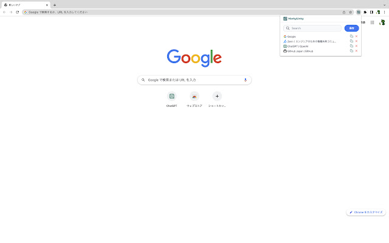

# MarkyLinky


■ Chrome Web Store
 - [MarkyLinky - Chrome ウェブストア](https://chrome.google.com/webstore/detail/markylinky/kjjjfmbnaamaogjpjdgeiffgjabbpmfp?hl=ja)


## 説明



 - URLを保存/削除、Markdownを出力ができるブラウザ拡張

## コマンド

### ローカル起動

```bash
$ yarn dev
```

### ビルド

```bash
$ yarn build
```

### パッケージ化

```bash
$ yarn package
```

### マイグレーションファイル作成

```bash
$ supabase migration new xxxxxx
```

### ローカル環境でマイグレーション

```bash
$ supabase migration up
```


### 本番環境にデータベースを反映

```bash
$ supabase db push
```

### ローカル環境でfunctionsを起動

```bash
$ supabase functions serve --no-verify-jwt
```

### 本番環境にfunctionsをデプロイ

```bash
$ supabase functions deploy *****
```